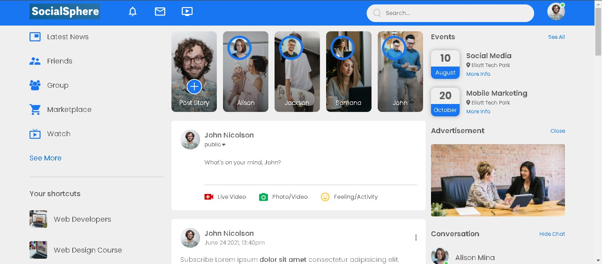
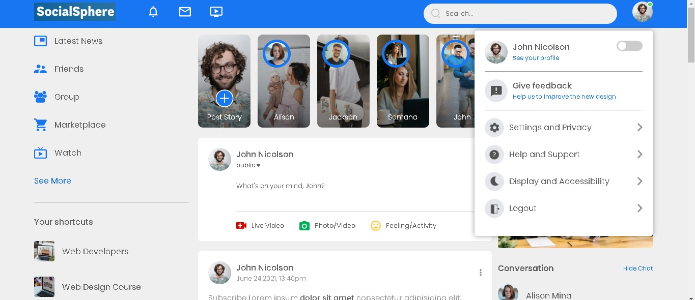
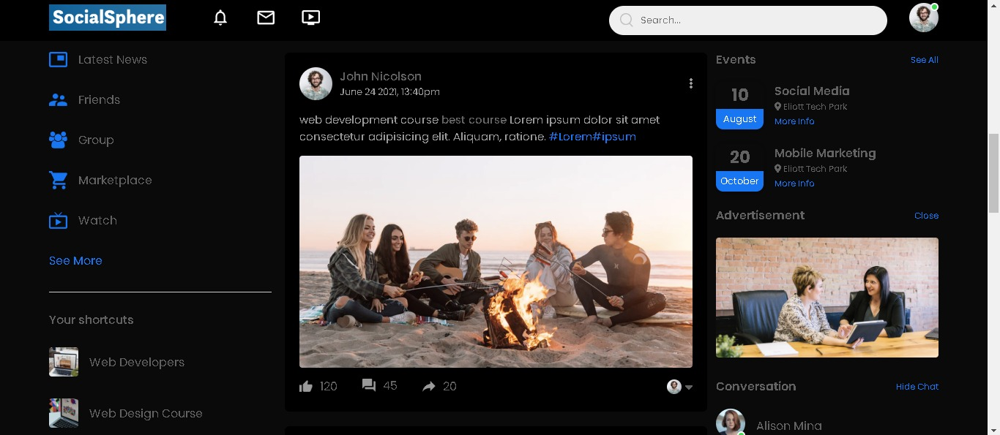

# **Social Sphere** 🌐

Welcome to **Social Sphere** – a modern social media website clone crafted with HTML, CSS, and JavaScript. Designed to capture the essence of social networking, Social Sphere offers a sleek and interactive platform for users to connect, share, and engage.







## **Features** ✨

- **User Profiles**: Create and customize user profiles with personal information and profile pictures. 👤
- **News Feed**: Share updates, photos, and status with your network in a dynamic and engaging feed. 📜
- **Friend Requests**: Send and receive friend requests to expand your social circle. 🤝
- **Messaging**: Communicate with friends through real-time messaging. 💬
- **Notifications**: Stay updated with notifications for new messages, friend requests, and activity. 🔔
- **Responsive Design**: Access Social Sphere seamlessly on any device, from desktop to mobile. 📱💻
- **Dark Mode**: Experience a visually appealing dark theme that reduces eye strain and enhances focus. 🌙

## **Tech Stack** 🔧

- **HTML**: Provides the foundational structure and content of the website. 🏗️
- **CSS**: Styles the website with a modern, responsive design. 🎨
- **JavaScript**: Powers interactive features and dynamic content updates. ⚙️

## **Installation** 🚀

To run Social Sphere locally:

### **Clone the repository:**

```sh
git clone https://github.com/your-username/social-sphere.git
```
## **Navigate to the project directory**:
```sh
cd social-sphere
```
## **Open the application**:
**Open index.html in your preferred web browser to view the website. 🌐**

## **Usage 📖**:
- Home Page: Displays an overview of the user's news feed with posts from friends and network updates. 🏠
- Profile Page: View and edit your profile information, including profile picture and bio. 🖼️

## **Contributing 🤝**:
**We welcome contributions to enhance Social Sphere. To contribute, please follow these steps**:
1. Fork the repository:
   - Click the "Fork" button at the top right of this page to create your own copy of the repository.
2. Clone your fork:
   ```sh
   git clone https://github.com/your-username/social-sphere.git
   cd social-sphere
   ```
3. Create a branch:
   ```sh
   git checkout -b feature/your-feature
   ```
4. Make your changes:
   **Implement your feature or bug fix.**
5. Commit your changes:
   ```sh
   git add .
   git commit -m 'Add some feature'
   ```
6. Push to the branch:
   ```sh
   git push origin feature/your-feature
   ```
7. Create a Pull Request:
   - Navigate to your forked repository on GitHub.
   - Click the "New pull request" button.

## **Contact 📧**:
**For any inquiries or suggestions, feel free to reach out**:
- Email: baksisrijita04@gmail.com
- github: https://github.com/SrijitaBaksi

**Thank you for exploring Social Sphere! We hope our social media clone brings a fresh and engaging experience to your social networking needs.**
   
